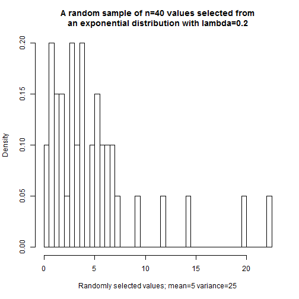
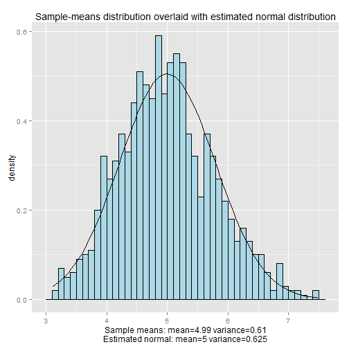

## Investigate the Central Limit Theorem using simulated sampling distributions drawn from an exponential distribution

**Rob Alderman**   
**March, 2015**

The Central Limit Theorem tells us that, if we draw multiple samples from a 
given population and compute the mean for each sample, the distribution of sample
means will approximate a normal distribution, and the mean and variance of the
sample-means distribution will relate to the underlying population as follows:

```
E[X'] = E[X]
Var[X'] = Var[X] / n
```

...where:

```
E[X] is the mean of the population 
Var[X] is the variance of the population
E[X'] is the mean of the sample-means distribution
Var[X'] is the variance of the sample-means distribution
n is the size of each sample
```

That is to say, the sample-means distribution mean is approximately equal to the underlying 
population mean, and the sample-means distribution variance is approximately equal to the 
underlying population's variance divided by the size of the sample.  This is true
regardless of the distribution of the underlying population.

In this report we use R to simulate taking multiple samples of values selected at random from 
an exponential distribution.  The exponential distribution serves as our underlying population.
We investigate the characteristics of the sample-means distribution, namely its mean
and variance, and compare them to the known characteristics of the underlying exponential distribution
in order to verify that our results are consistent with the Central Limit Theorem.


### Simulations

We use the R function `rexp` to select random values from the exponential distribution.  The rate 
parameter of the exponential distribution is lambda=0.2.  The mean of the exponential distribution
is 1/lambda.  Its variance is 1/lambda^2.  The sample size is n=40.  A single sample is plotted
below in a density histogram:


```r
set.seed(1)
lambda=0.2
n=40

exp.dist.mean=1/lambda
exp.dist.var=1/lambda^2

hist(rexp(n,lambda),
     breaks=50,
     freq=F,
     main=paste("A random sample of n=", n, 
                " values selected from\n",
                "an exponential distribution with lambda=",lambda, 
                sep=""),
     xlab=paste("Randomly selected values; mean=", exp.dist.mean, 
                " variance=", exp.dist.var, 
                sep=""))
```

 

Note that the exponential distribution does not resemble a normal distribution.

We then simulate taking 1000 samples from the exponential distribution, each with size n=40, and calculate the 
mean of each sample.  This serves as our sample-means distribution.  The sample-means distribution is
plotted below, again with a density histogram:


```r
sample.means.dist = NULL
for (i in 1:1000) sample.means.dist = c(sample.means.dist,mean(rexp(n,lambda)))

sample.means.dist.mean = round(mean(sample.means.dist),2)
sample.means.dist.var= round(var(sample.means.dist),2)

# For overlaying a normal distribution curve that estimates the 
# characteristics of the sample-means distribution.
estimated.sample.means.dist.mean = exp.dist.mean
estimated.sample.means.dist.var = exp.dist.var / n

library(ggplot2)
ggplot(data=NULL, aes(x=sample.means.dist)) + 
    geom_histogram(aes(y=..density..), 
                   fill="lightblue",
                   colour="black",
                   binwidth=0.1 ) +
    ggtitle("Sample-means distribution overlaid with estimated normal distribution") +
    xlab(paste("Sample means: mean=", sample.means.dist.mean,
               " variance=", sample.means.dist.var,
               "\nEstimated normal: mean=", estimated.sample.means.dist.mean,
               " variance=", estimated.sample.means.dist.var,
               sep="")) +
    stat_function(fun = dnorm, 
                  arg=list(mean=estimated.sample.means.dist.mean,
                           sd=sqrt(estimated.sample.means.dist.var))) 
```

 

We've overlaid the data with a normal distribution curve using the estimated mean and variance of the sample-means
distribution.  The Central Limit Theorem tells us the estimated mean is equal to the underlying population mean, 
and the estimated variance is equal to the underlying population variance divided by the sample size, n.

### Results

As you can see, the estimated normal distribution curve fits nicely over the sample-means distribution data.
This is consistent with the Central Limit Theorem.

The estimated mean and variance of the sample-means distribution, as estimated from the mean and variance
of the underlying exponential distribution, are shown in the chart, along with the mean and variance of the 
actual sample-means distribution, as calculated from our simulation.  The values are consistent with 
Central Limit Theorem.

### In Conclusion

The results of our simulation are consistent with the Central Limit Theorem.  The mean and variance of 
our simulated sample-means distribution relate to the underlying population's mean and variance as predicted
by the Central Limit Theorem.

